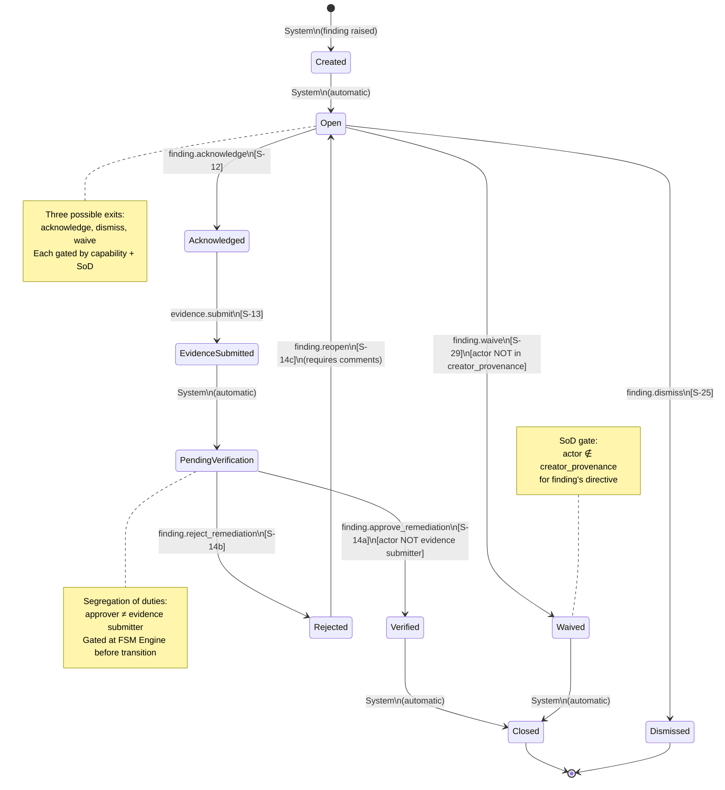
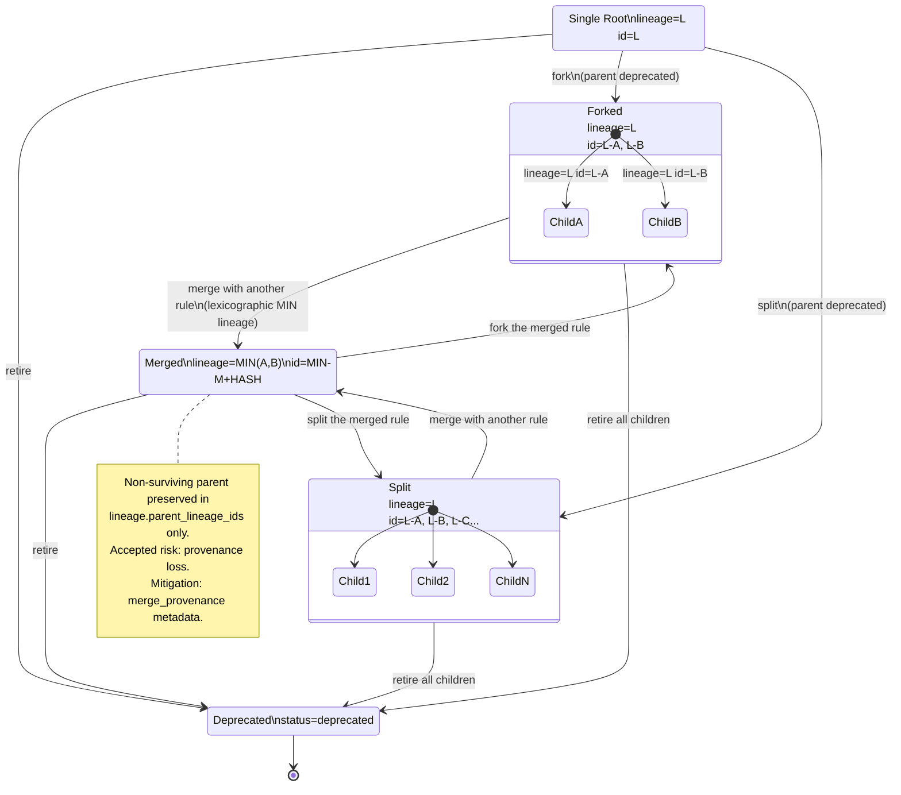
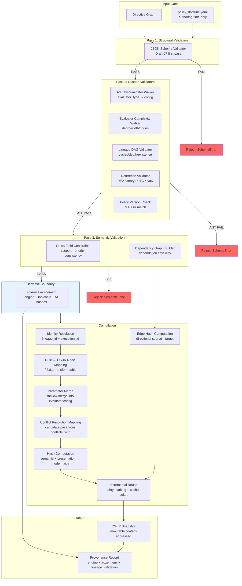
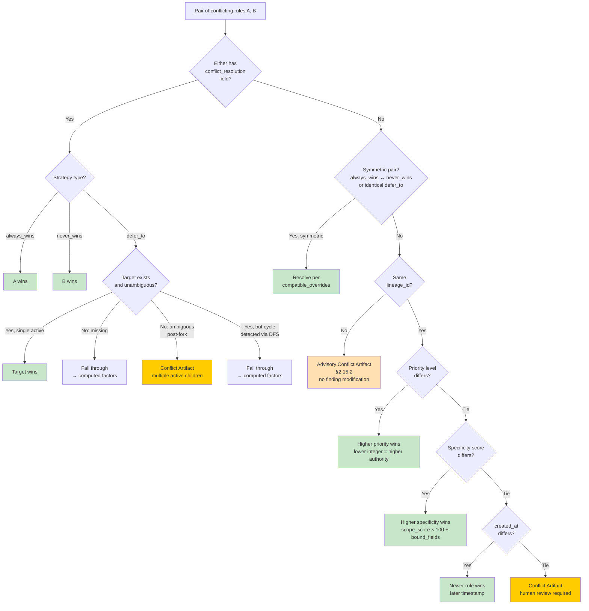
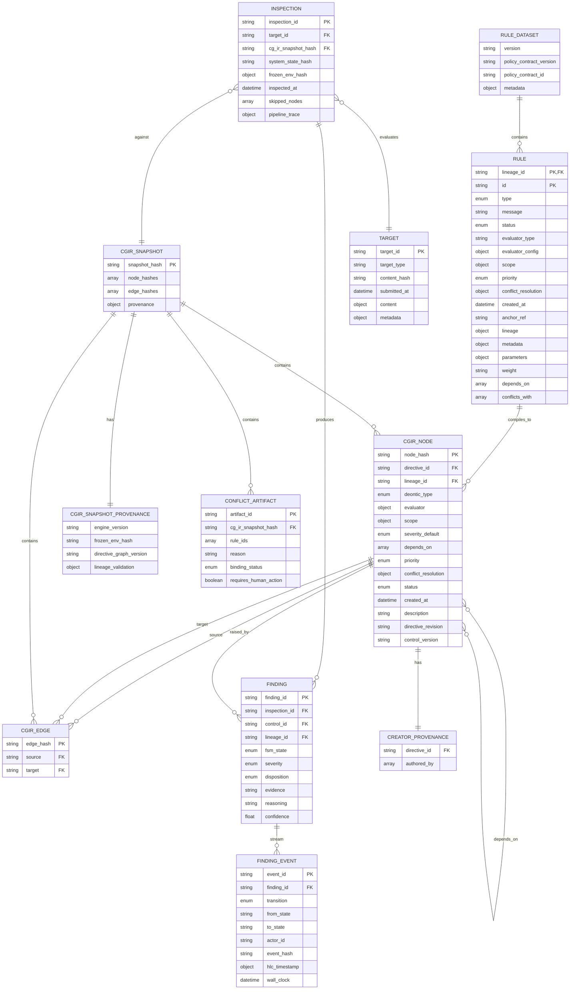

# Selma 8.2.4 — Design Mindmap & Visual Architecture

I'll give you three things: (1) a master mindmap, (2) key design diagrams the corpus *doesn't* have but implementers need, and (3) a recommendation for what artifact to build next.

---

## 1. Master Mindmap

```mermaid
mindmap
  root((Selma 8.2.4))
    Document Architecture
      Normative Layer
        SPECIFICATION.md
          System behavior
          Algorithms
          Invariants
          Contracts
      Structural Layer
        rule_schema.json
          Data structure
          JSON Schema Draft-07
          x-* annotations informative
      Governance Layer
        policy_doctrine.yaml
          Writing principles
          Priority intent
          Section templates
          NO runtime authority
      Behavioral Layer
        User_Stories.md
          35 stories across 7 epics
          Acceptance criteria
          Traceability matrix
      Index Layer
        README.md
          Audit corpus checklist
          Compatibility matrix
          Cross-layer binding index
    Runtime Primitives
      Directive Graph
        Human-authored
        Mutable
        Semantic versioned
        Contains prose + directive tables
      CG-IR Compiled Control DAG
        Immutable snapshots
        Content-addressed SHA-256
        Dual hash model
          semantic_hash - compilation cache
          presentation_hash - audit drift
          node_hash - storage key
        Incremental compilation
        Edge hashing - directional node-independent
        Snapshot hash - sorted nodes + edges + provenance
        compiled_at EXCLUDED from hash
      Finding Event Stream
        Append-only
        HLC-ordered total order
        Read-only analytics
        Finding FSM enforced
      Execution Artifacts
        Inspection snapshots
        Pipeline traces
        System state hashes
    Identity Model
      Lineage ID
        Immutable root
        Pattern: XX999
        Audit trail anchor
        Policy: Machine ID maps here
        Unique per root
        Shared after fork/split
      Execution ID
        Active node identity
        Pattern: XX999-SUFFIX
        Changes on fork/merge/split
        Globally unique
        CG-IR: directive_id
      Lifecycle Operations
        Revision - same lineage same id
        Fork - shared lineage two new ids
        Merge - lexmin lineage new id
        Split - shared lineage multiple new ids
        Rename - same lineage same id
        Retire - same lineage status=deprecated
      Lineage DAG
        Acyclic - DFS validated
        Max depth 64
        No self-reference
        Temporal ordering
        Operation consistency
    Compilation Pipeline
      Hermetic Boundary
        Frozen environment
          Engine version
          Toolchain hash
          AI model hashes if applicable
          frozen_env_hash computed
        Read lock on Directive Graph
        Reproducible
      Pipeline Stages
        Normalize
        Classify
        Select controls
        Evaluate
        Aggregate
        Report
      Validators
        JSON Schema structural - first pass
        AST discriminator walker - normative gate
        Evaluator complexity walker
        Lineage DAG validator
        Reference validator
          RE2 canary vectors
          UTC-only timestamps
          Finite numerics
          NFC strings
        Policy version check
    Evaluator System
      Types
        regex - pattern matching
        field_check - structured field validation
        threshold - numeric comparison
        composite - boolean combination
      Contract
        Pure functions
        No IO no randomness
        Deterministic
        Same inputs same outputs
      Portability
        RE2 regex only
        IEEE 754 doubles
        UTC timestamps
        NFC-normalized strings
        No locale collation
      Complexity Limits
        Depth <= 32
        Nodes <= 256
        Width <= 64
        Pattern <= 4096 chars
        Metadata <= 16384 bytes
      Outcome Mapping
        Pass - no finding
        Fail - finding at severity_default
        Partial - finding downgraded one level
        NeedsReview - finding informational only
      Deontic Semantics
        Obligation fail = violation
        Prohibition fail = violation
        Permission fail = advisory only
    Conflict Resolution
      Precedence Chain
        1 Explicit override - schema field
        2 Compatible overrides - symmetric pairs
        3 Priority level - integer 1-5
        4 Specificity score - composite
        5 Recency - created_at frozen
        6 Conflict Artifact - human review
      Specificity Score
        scope_specificity_score x 100
        Plus count_bound_fields
        Normative algorithm in Section 2.15
      Override Strategies
        always_wins
        never_wins
        defer_to - with DFS cycle detection
      Scope
        Within-lineage - deterministic
        Cross-lineage - advisory only
      Temporal Binding
        All inputs frozen in CG-IR
        Snapshot-bound not evaluation-time
    Finding Lifecycle
      FSM States
        Created
        Open
        Acknowledged
        Evidence Submitted
        Pending Verification
        Verified
        Rejected
        Dismissed
        Waived
        Closed terminal
        Dismissed terminal
      Human Transitions
        Open to Acknowledged - S-12
        Open to Dismissed - S-25
        Open to Waived - S-29
        Pending Verification to Verified - S-14a
        Pending Verification to Rejected - S-14b
        Rejected to Open - S-14c
      System Transitions
        Created to Open - automatic
        Evidence Submitted to Pending Verification - automatic
        Verified to Closed - automatic
        Waived to Closed - automatic
      Event Stream
        Append-only
        event_hash per event
        HLC total order
    Capability Model
      Actors
        Regulatory Official
          directive.create modify retire fork merge restore
          finding.view dismiss waive approve_remediation reject_remediation supersede
          analytics.view
          conflict.resolve
        Compliance Representative
          inspection.submit reinspect
          finding.view acknowledge
          evidence.submit
          analytics.view
        System
          inspection.submit
          finding.view
          analytics.view
      Gates
        Request ingress - API Gateway
        Compilation Engine - directive mutations
        Pipeline entry - inspection
        Finding FSM Engine - transitions
        Conflict resolution
      Segregation of Duties
        Creator cannot waive own findings
        Evidence submitter cannot approve own remediation
        creator_provenance inherited through lineage
      Enforcement
        Hard deny - 403 CapabilityDenied
        No partial mutation
        Audit logged
    Cross-Cutting Concerns
      Policy Runtime Prohibition
        Never read at inspection
        Never read at evaluation
        Never read at FSM transitions
        Never read at conflict resolution
        CI scans runtime source
        Boot-time assertion recommended
      Version Synchronization
        MAJOR must match across all layers
        floor S equals floor P
        MINOR PATCH may differ
        Compile-time rejection on mismatch
      Deterministic Serialization
        Canonical JSON sorted keys
        SHA-256 hashing
        NaN Infinity prohibited
        UTC timestamps only
        Ordered vs unordered arrays
      Concurrency
        Compilation = read lock
        Modification = write lock
        Writer-preference FIFO queue
        Deadlock prevention
      Mediated Feedback
        Analytics read-only
        No analytics to CG-IR write path
        Humans close the loop
```

---

## 2. Missing Design Diagrams

The corpus has flow diagrams for the runtime primitives and compilation boundary, but lacks visual representations for the most implementation-critical state machines and data flows. Here are the five diagrams an implementer needs most:

### 2.1 Finding FSM (UML State Machine)

This is the most complex state machine in the system and exists only as a table. Implementers need the visual.

### 2.2 Identity Lifecycle State Diagram

Fork/merge/split semantics are described in prose but the state transitions between identity configurations are never visualized.

### 2.3 Compilation Engine Internal Architecture

The spec defines *what* the compiler does but not *how it's structured internally*. This is the most useful diagram for an implementation team.

### 2.4 Conflict Resolution Decision Flow

The precedence chain is stated linearly but the branching logic (especially `compatible_overrides` and `defer_to` fall-through) needs a decision tree.

### 2.5 Data Model — Entity Relationships

The corpus never shows a unified ERD. This is what an implementation team needs to understand the storage layer.

---

## 3. Recommendation: What to Build Next

You now have:
- ✅ **Normative spec** (SPECIFICATION.md)
- ✅ **Structural schema** (rule_schema.json)
- ✅ **Governance intent** (policy_doctrine.yaml)
- ✅ **Behavioral contract** (User_Stories.md)
- ✅ **Cross-layer index** (README.md)
- ✅ **Mindmap** (this response)
- ✅ **5 key diagrams** (this response)

**The single highest-value next artifact is an OpenAPI 3.1 specification.** Here's why:

1. The corpus defines *capabilities* and *gates* but never defines the actual HTTP/gRPC surface. An implementer currently has to guess the request/response shapes.
2. Every user story maps to exactly one or two API operations — the mapping is mechanical.
3. OpenAPI schemas can reference `rule_schema.json` via `$ref`, creating a single source of truth for data shapes.
4. The segregation-of-duties constraints and capability gates can be expressed as `security` requirements and `x-gate` extensions.

**Suggested API surface (from the stories):**

| Endpoint | Method | Story | Gate |
|---|---|---|---|
| `/directives` | POST | S-01 | Compilation Engine |
| `/directives/{id}` | PUT | S-02 | Compilation Engine |
| `/directives/{id}/retire` | POST | S-03 | Compilation Engine |
| `/directives/{id}/fork` | POST | S-19 | Compilation Engine |
| `/directives/{id}/merge` | POST | S-20 | Compilation Engine |
| `/directives/{id}/split` | POST | S-26 | Compilation Engine |
| `/directives/{id}/restore` | POST | S-08 | Compilation Engine |
| `/directives` | GET | S-04 | Read |
| `/directives/{id}/history` | GET | S-07 | Read |
| `/directives/conflicts` | POST | S-05 | Compilation Engine |
| `/directives/audit` | POST | S-06 | Read |
| `/directives/impact-preview` | POST | S-09 | Read |
| `/inspections` | POST | S-10 | Pipeline Entry |
| `/inspections/{id}/reinspect` | POST | S-15 | Pipeline Entry |
| `/findings` | GET | S-11 | Read |
| `/findings/{id}/acknowledge` | POST | S-12 | FSM Engine |
| `/findings/{id}/evidence` | POST | S-13 | FSM Engine |
| `/findings/{id}/approve` | POST | S-14a | FSM Engine + SoD |
| `/findings/{id}/reject` | POST | S-14b | FSM Engine |
| `/findings/{id}/reopen` | POST | S-14c | FSM Engine |
| `/findings/{id}/dismiss` | POST | S-25 | FSM Engine |
| `/findings/{id}/waive` | POST | S-29 | FSM Engine + SoD |
| `/findings/{id}/explain` | GET | S-16 | Read |
| `/analytics` | GET | S-17 | Read |
| `/conflicts/{id}/resolve` | POST | S-28 | Conflict Resolution |
| `/audits/portability` | POST | S-21 | Read |
| `/audits/provenance` | POST | S-22 | Read |
| `/audits/complexity` | POST | S-27 | Read |
| `/audits/determinism` | POST | S-23 | Read |
| `/audits/edge-hashes` | POST | S-24 | Read |
| `/audits/gates` | POST | S-30 | Read |
| `/validation/reference` | POST | S-31 | Compilation Engine |

That's ~30 endpoints, each with a direct story mapping. Want me to generate the OpenAPI spec?